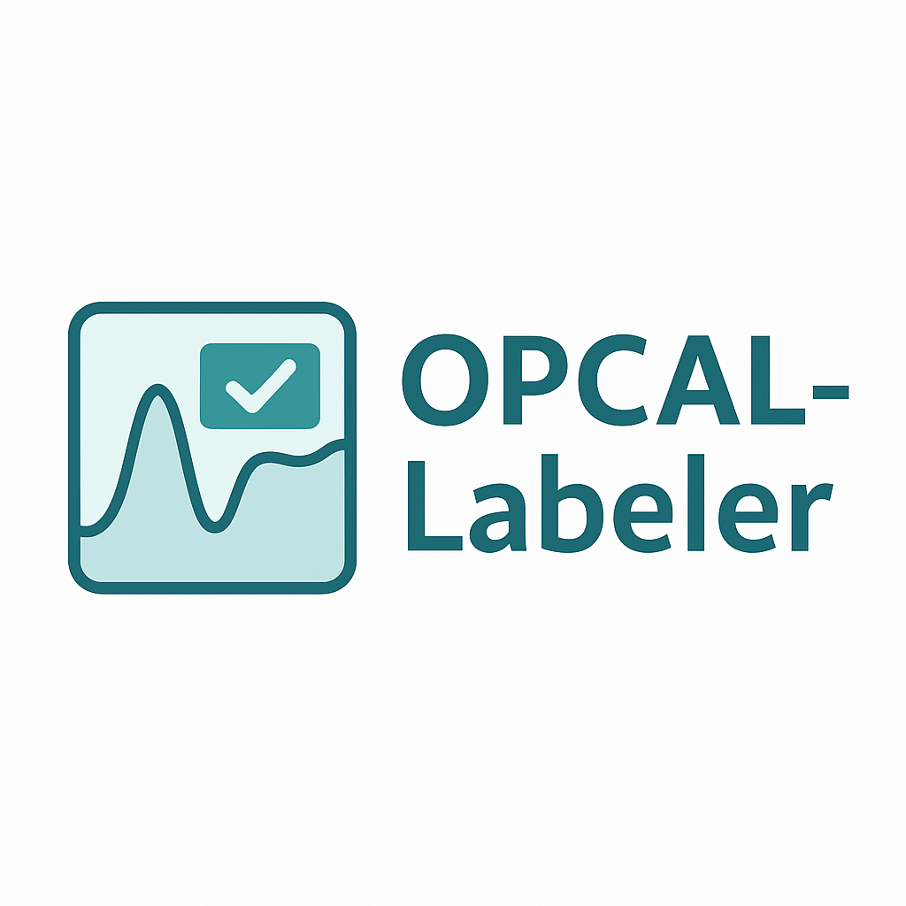

# OPCAL‑MLT · Manual Labeling Tool

<p align="center">
  
</p>

> Lightweight Streamlit workspace for labeling calcium imaging (ΔF/F) traces with baseline-aware visualization and reproducible exports.

---

## Quick links

- [User guide](docs/USER_GUIDE.md) — full walkthrough for annotators
- [Quickstart](docs/quickstart.md) — five-minute setup + first labels
- [Data & API contracts](docs/API.md) — CSV schemas, metadata fields, helpers
- [Architecture](docs/architecture.md) — layer-by-layer tour for contributors
- [Testing playbook](docs/testing.md) — unit/integration/UI procedures
- [Data guide](docs/data/README.md) — storage layout & backup policy
- [Research notes](docs/dev/summary_notes.md) — text summaries of PDF specs
- [Changelog](docs/CHANGELOG.md) — release history and upgrade notes

---

## At a glance

| Capability | Details |
| --- | --- |
| Guided flow | Four stages (Start → Upload & indexing → Workspace → Finish & export) with persistent session state |
| Visual policy | Pre-stimulus STD band fixed to 1·σ, post-stimulus band scales with `k`; thresholds stay consistent with detection logic |
| Outputs | Deterministic session CSVs (`session.csv`, `cell_map.csv`, `labels.csv`, `peaks.csv`), ZIP archive export, and class-wise training CSV export |
| Services | Typed domain + service layer for ingesting traces, saving labels, and exporting sessions |
| Versioning | App UI and package metadata report `1.2.0` via `opcal_mlt.version.get_app_version()` |

---

## System overview

```
src/opcal_mlt/
  app/           # Streamlit UI, routing, state adapter, theming, custom components
  core/          # Signal processing helpers (preprocess, peaks, feature summaries)
  domain/        # Enums and dataclasses used throughout the app
  services/      # File-system aware facades (sessions, ingest, labeling, export)
```

Key concepts:
- **StateAdapter** wraps `st.session_state` to keep the UI typed and testable.
- **Router** binds workflow stages (`Stage.START → Stage.EXPORT`) to page render functions.
- **SessionService** owns session directory creation, hydration, and listings.
- **LabelingService** persists labels/peaks and computes summary features, all routed through `session_io` helpers to guarantee CSV schemas.

---

## Running a Release Build

For annotators and other non-technical users, use the standalone release ZIP for
your operating system:

1. Download `OPCAL-MLT-1.2.0-windows.zip` or `OPCAL-MLT-1.2.0-macos.zip`.
2. Unzip it into a local folder such as `C:\Users\<you>\OPCAL-MLT` or
   `~/Applications/OPCAL-MLT`.
3. Launch the app:
   - Windows: double-click `OPCAL-MLT.exe`.
   - macOS: double-click `OPCAL-MLT.app`.
4. The browser opens at `http://localhost:8501`; keep the app running while
   labeling.

The release build bundles Python and dependencies. Do not ask annotators to run
`pip`, create a virtual environment, or use a terminal unless they are using the
source fallback below.

## Source Prerequisites

- Python **3.12** (match the version declared in `pyproject.toml`)
- Install dependencies via `requirements.txt` **or** the Conda `environment.yml`
- Node/JS is **not** required; Streamlit bundles its own frontend
- (Optional) `watchdog` package speeds up Streamlit autoreload on macOS/Linux
- Prefer a local, non-synced project folder such as `~/Projects/OPCAL---MLT` or `C:\Users\<you>\Projects\OPCAL---MLT`; virtual environments inside iCloud/OneDrive folders can be slow or partially restored.

---

## Source fallback

Use this only for development or when no standalone build is available.

### macOS / Linux

```bash
cd /path/to/OPCAL---MLT
python3.12 -m venv .venv
source .venv/bin/activate
python -m pip install -U pip setuptools wheel
python -m pip install -e .
opcal-mlt
```

The bundled launcher performs an import/version sanity check and can rebuild a
broken local `.venv` on request:

```bash
./scripts/OPCAL-Labeler.command
./scripts/OPCAL-Labeler.command --rebuild
```

For contributor tools and tests, install the dev extra instead:

```bash
python -m pip install -e ".[dev]"
ruff check src tests
pytest
```

### Windows PowerShell

```powershell
cd C:\Users\<you>\Projects\OPCAL---MLT
py -3.12 -m venv .venv
.\.venv\Scripts\Activate.ps1
python -m pip install -U pip setuptools wheel
python -m pip install -e .
opcal-mlt
```

If PowerShell blocks activation scripts, run this in the same PowerShell window and retry activation:

```powershell
Set-ExecutionPolicy -Scope Process -ExecutionPolicy Bypass
```

You can also launch through the bundled helper:

```powershell
powershell -ExecutionPolicy Bypass -File .\scripts\OPCAL-Labeler.ps1
powershell -ExecutionPolicy Bypass -File .\scripts\OPCAL-Labeler.ps1 --rebuild
```

Default Streamlit address: `http://localhost:8501`

Useful launcher diagnostics:

```bash
opcal-mlt --version
opcal-mlt --diagnostics
opcal-mlt --headless --server.port 8502
```

> **Tip:** running `opcal-mlt` copies `.streamlit/config.toml` from `src/opcal_mlt/app/config/streamlit_theme.toml` automatically (handled by `launch.py`).

---

## Data lifecycle

| Stage | What happens | Files touched |
| --- | --- | --- |
| Start | Create or resume a session; ensure `session_dir` exists | `session.csv` header, `cell_map.csv` (if IDs available) |
| Upload & indexing | Load traces (`.csv`/`.npz`), choose cell IDs (auto, headers, external map) | Populates in-memory trace set, optionally reuses prior `cell_map.csv` |
| Workspace | Visualise baseline vs ΔF/F, save labels with notes & uncertainty flag, compute peaks/features | Append rows to `labels.csv` and `peaks.csv` |
| Finish & export | Aggregate statistics, optionally ZIP the session folder | `labels.csv`, `cell_map.csv`, `session.csv`, `peaks.csv`, exported archive |
| Training export | Split confident labels into class-wise headerless CSVs and uncertain labels into a separate CSV | `training_csv_export_*/*.csv`, `training_csv_export_*.zip` |
| Archive & backup | Copy session folders into `data/labeled_sessions/` and zip nightly | `data/` tree (see [Data guide](docs/data/README.md)) |

### CSV schemas (summary)
- `session.csv`: one row per app launch, including timestamps, annotator, app version, fs.
- `cell_map.csv`: stable mapping from `cell_index` → `cell_id`.
- `labels.csv`: per-cell annotations with processing metadata and derived features.
- `peaks.csv`: per-peak measurements linked to `labels.csv` rows.

Full field descriptions live in [docs/API.md](docs/API.md).

---

## Working on the codebase

### Tests & static checks

```bash
# Unit tests
pytest

# Linting (Ruff) & formatting (Black)
ruff check src tests
black --check src tests
```

Core unit suites live in `tests/unit/` and focus on domain/services correctness. Extend them when introducing new service behaviour or data formats. See [docs/testing.md](docs/testing.md) for full policy.

### Documentation standard

- Docstrings follow the Google style described in `docs/dev/documentation_style.md`.
- Keep module summaries concise and emphasise intent and domain context rather than restating types.
- Inline comments should explain *why* a choice was made or note domain caveats; remove redundant legacy notes when touching code.

### Streamlit development workflow
- Run `opcal-mlt` in one terminal with `--server.runOnSave=true` (Streamlit menu) for live reload.
- Keep business logic outside Streamlit pages: implement in `services/` or `core/`, then call from `views/`.
- Avoid writing to disk directly from views; always go through the relevant service so CSV schemas remain consistent.

### Release checklist (manual)
1. Align version strings (`pyproject.toml`, `app/app.py::APP_VERSION`, docs).
2. Update [docs/CHANGELOG.md](docs/CHANGELOG.md) with dated entries.
3. Smoke-test the 4-step flow on representative CSV and NPZ data.
4. Verify both exports: full session ZIP and class-wise training CSV ZIP.
5. Build platform bundles with `python tools/distribution/build.py --clean` (see `docs/distribution.md`) and use source launchers only as a fallback.
6. Tag the release in Git and attach the docs/demos requested by the team.

---

## Troubleshooting

| Symptom | Likely cause | Suggested fix |
| --- | --- | --- |
| `KeyError: No route registered for stage` | New workflow stage added without router registration | Update `app/app.py` to register the stage with the `Router` |
| Session resets after page refresh | Session directory not initialised; state not hydrated | Complete Step 1 (annotator + save dir) or call `SessionService.hydrate_labels` |
| `ValueError: traces must be a 2D array (T x N)` | Uploaded trace file shape mismatch | Reshape input so columns represent cells |
| Duplicate cell ID warning | External mapping or headers contain repeats | Adjust mapping or regenerate IDs using the auto-ID helper |

If you hit an unexpected bug, enable `streamlit run ... --logger.level=debug` and consult the terminal logs alongside `session.log` written next to `labels.csv`.

---

For roadmap items, open tasks, and post-release actions see `docs/todo.md`.
