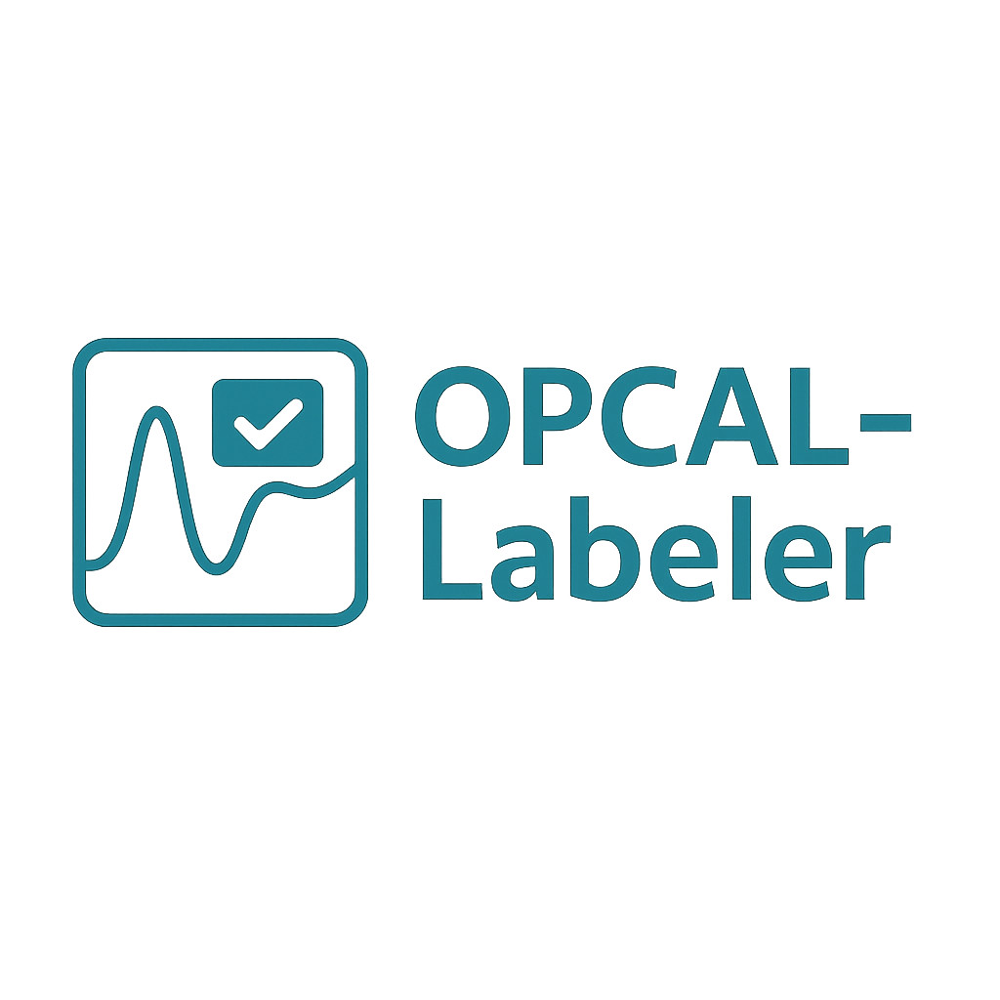

# OPCAL‑MLT — Manual Labeling Tool

A lightweight Streamlit application for manual labeling of calcium imaging traces (ΔF/F) with baseline and stimulus‑aligned utilities.

> **Version:** preparing for **v1.0.0** (current package tag: `0.4.0`)

---

## Table of contents

- [OPCAL‑MLT — Manual Labeling Tool](#opcalmlt--manual-labeling-tool)
  - [Table of contents](#table-of-contents)
  - [Overview](#overview)
  - [Key features](#key-features)
  - [Installation](#installation)
  - [Quick start](#quick-start)
  - [Data inputs \& assumptions](#data-inputs--assumptions)
  - [Workflow](#workflow)
  - [STD rectangles: pre vs post](#std-rectangles-pre-vs-post)
  - [Project structure](#project-structure)
  - [Development](#development)
    - [Code style \& docs](#code-style--docs)
  - [Releases \& versioning](#releases--versioning)
  - [Troubleshooting](#troubleshooting)
  - [FAQ](#faq)
  - [License](#license)
    - [Changelog (pointer)](#changelog-pointer)

---

## Overview

OPCAL‑MLT is a manual labeling tool for trace data where the user defines event labels around a known stimulus time. The app emphasizes clear visualization of baseline vs. ΔF/F, consistent STD bands, and simple export of labels.

The codebase is split into `app/` (UI) and `core/` (signal utilities), striving for clear boundaries: UI renders; core computes.

## Key features

* Streamlined 4‑step flow (start → upload & index → label → finish & export).
* Baseline + ΔF/F visualization with robust statistics.
* **STD rectangles policy:** pre‑stimulus band (green) uses **k = 1**; post‑stimulus band (red) uses **k**.
* Keyboard navigation for fast annotation (if enabled in screens).
* Export labels to CSV within a session directory.

## Installation

Using an editable install during development:

```bash
# From repo root
python3 -m venv .venv
source .venv/bin/activate
pip install -U pip
pip install -e .
```

Run the app:

```bash
opcal-mlt
# or
python -m opcal_mlt.app.main
```

Default URL: `http://localhost:8501`

## Quick start

1. **Start session** — choose/create a working session.
2. **Upload & indexing** — load traces (`.npy`/`.csv`) and IDs; the app validates shapes and types.
3. **Label files** — browse cells, adjust stimulus parameters, add labels.
4. **Finish & export** — write labels to disk (`labels.csv` in the session folder).

## Data inputs & assumptions

* **Traces**: 2D array `[n_cells, n_samples]` (`float32` recommended).
* **Cell IDs**: 1D array/list of length `n_cells` (string/int).
* **Time**: either provided or inferred by sampling rate.
* **Stimulus time (seconds)**: used to split pre/post segments.

## Workflow

* Baseline is computed using a consistent method (rolling median or percentile) on the pre segment unless otherwise specified.
* ΔF/F is shown relative to baseline.
* A constant threshold can be derived as `baseline + k·STD_pre`; bands are drawn to guide the eye (see policy below).

## STD rectangles: pre vs post

To improve interpretability and match review policy:

* **Pre (green)**: band height = `baseline + 1·STD_pre` (i.e., **k = 1**).
* **Post (red)**: band height = `baseline + k·STD_post` (i.e., user‑controlled **k**).

> Note: Threshold logic may continue to use `baseline + k·STD_pre` for detection consistency; the rectangles are a visual aid and should not double‑apply `k`.

## Project structure

```
src/opcal_mlt/
  app/
    main.py            # Streamlit entry point & routing
    screens.py         # Screen renderers (start, upload, label, finish)
    ui.py              # Theme/palette helpers (+ optional get_theme shim)
    components.py      # Reusable UI components (e.g., stepper)
    plots.py           # Plotly figure construction (no streamlit here)
  core/
    preprocess.py      # Signal utilities (smoothing, baseline, robust SD)
    workspace_logic.py # Data assembly for the labeling workspace
```

## Development

* Use `release/vX.Y` branches for release prep.
* Keep **screen function signatures** aligned with `main.py`. A typical signature is `render_xxx(*, s)`; only accept `theme` if the screen uses it.
* Keep plotting code inside `plots.py`; UI in `screens.py` and `components.py`.
* Avoid circular imports (`ui.py` should not import from `plots.py`).

### Code style & docs

* Short docstrings (English) for public helpers.
* Remove unused imports; prefer explicit, minimal dependencies in UI files.
* Preserve existing visual design unless a change is explicitly approved.

## Releases & versioning

* Prepare a release branch: `git checkout -b release/v1.0`.
* Update `APP_VERSION` in `main.py` when finalizing.
* Add a `CHANGELOG.md` entry summarizing user‑visible changes (see below).

**v1.0 highlights (planned):**

* Consolidated STD rectangles policy (pre k=1, post k).
* Safer routing in `main.py` (no implicit theme dependency).
* Minor stability fixes in `screens.py` (stimulus index bounds, guards).

## Troubleshooting

Common runtime errors seen during refactors and their meaning:

* `AttributeError: module 'opcal_mlt.app.ui' has no attribute 'get_theme'`

  * **Cause:** `main.py` expects `ui.get_theme`, but the UI module doesn’t define it.
  * **Fix:** either stop requesting a theme in `main.py`, or add a minimal `get_theme(...)` in `ui.py` that returns the existing palette.

* `TypeError: render_start_session() got an unexpected keyword argument 'theme'`

  * **Cause:** a screen was called with `theme=...` but its signature doesn’t accept it.
  * **Fix:** call screens only with `s=st.session_state`, or make `theme` optional in that screen.

* `TypeError: render_finish_export() takes 0 positional arguments but 1 was given`

  * **Cause:** the screen was called positionally instead of with keyword‑only `s`.
  * **Fix:** ensure the router passes `s=st.session_state` (keyword‑only).

* `IndentationError` / `SyntaxError: unmatched ')'`

  * **Cause:** manual merges left a stray parenthesis/indent.
  * **Fix:** reformat the region and re‑run; prefer small, reviewable patches.

## FAQ

**Q:** Do I need a theme to run the app?
**A:** No. The app runs with defaults. If `get_theme` exists, it’s used; otherwise the UI sticks to existing palette.

**Q:** Why is pre band not multiplied by `k`?
**A:** This was a deliberate decision to keep pre‑stimulus variability as a 1·STD reference and emphasize the effect size after the stimulus.

## License

MIT (or project‑specific license — update here if different).

---

### Changelog (pointer)

See `CHANGELOG.md` for detailed entries. For this release, include:

* UI: no visual changes unless specified.
* Plots: pre/post STD rectangle policy update.
* Main: safer dispatch and optional theme usage.
* Screens: signature guarding and stimulus index bounds.
